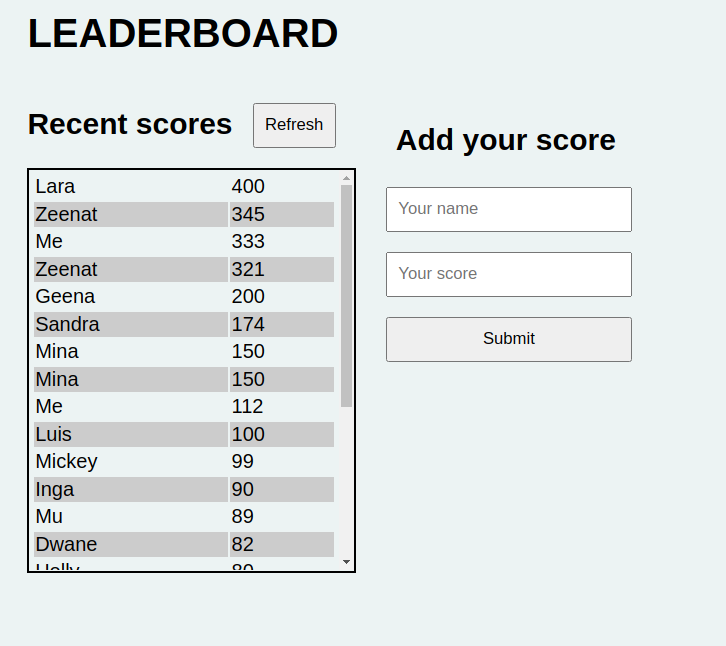
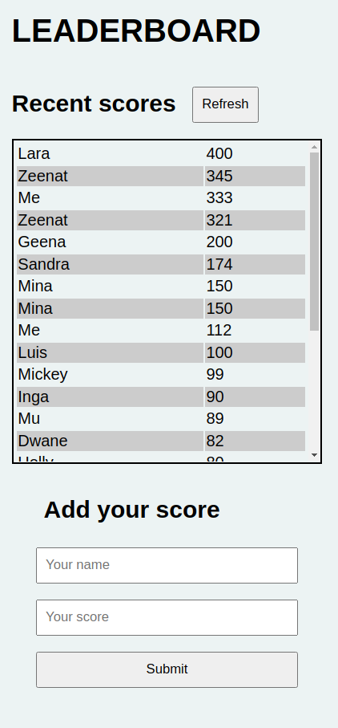
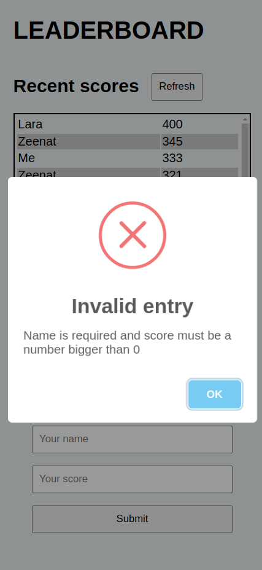

# LEADERBOARD

> Simple leaderboard example to practice with APIs.


 

## Built With

- HTML
- CSS
- JavaScript
- NPM
- Webpack

## Live Demo (if available)

[Live Demo Link](https://livedemo.com)


## Getting Started

**This is an example of how you may give instructions on setting up your project locally.**
**Modify this file to match your project, remove sections that don't apply. For example: delete the testing section if the currect project doesn't require testing.**


To get a local copy up and running follow these simple example steps.

### Prerequisites
- NPM
- Webpack
- linters: ESlint, Stylint, Hint
### Setup
```bash
git clone https://github.com/gdumani/leaderboard.git
cd leaderboard
```
### Install
```bash
npm install
```
### Usage
```bash
npm run start
```
### Run tests
```bash
npx stylelint "**/*.{css,scss}"
```

```bash
npx hint --telemetry=off .
```


## Authors

**Giancarlo Dumani**

- GitHub: [@gdumani](https://github.com/gdumani)
- Twitter: [@gdumani1](https://twitter.com/gdumani1)
- LinkedIn: [ Giancarlo-Dumani](https://www.linkedin.com/in/gdumani/?originalSubdomain=cr)


## 🤝 Contributing

Contributions, issues, and feature requests are welcome!

Feel free to check the [issues page](../../issues/).

## Show your support

Give a ⭐️ if you like this project!

## Acknowledgments

- Hat tip to anyone whose code was used
- Inspiration
- etc

## 📝 License

This project is [MIT](./MIT.md) licensed.
